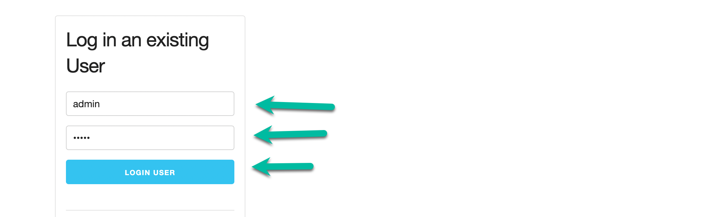
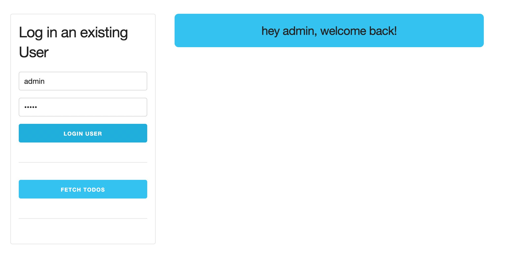
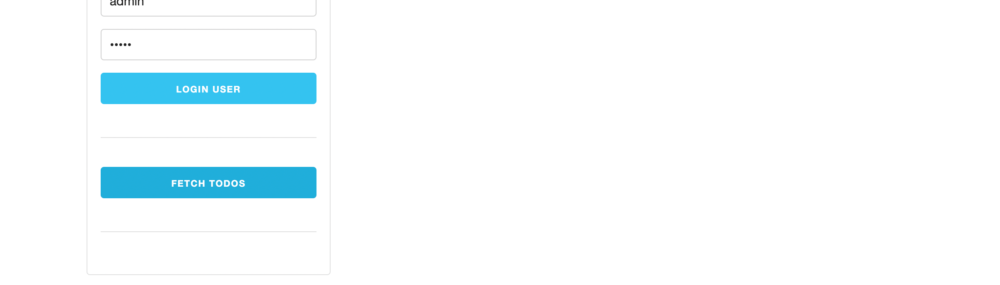
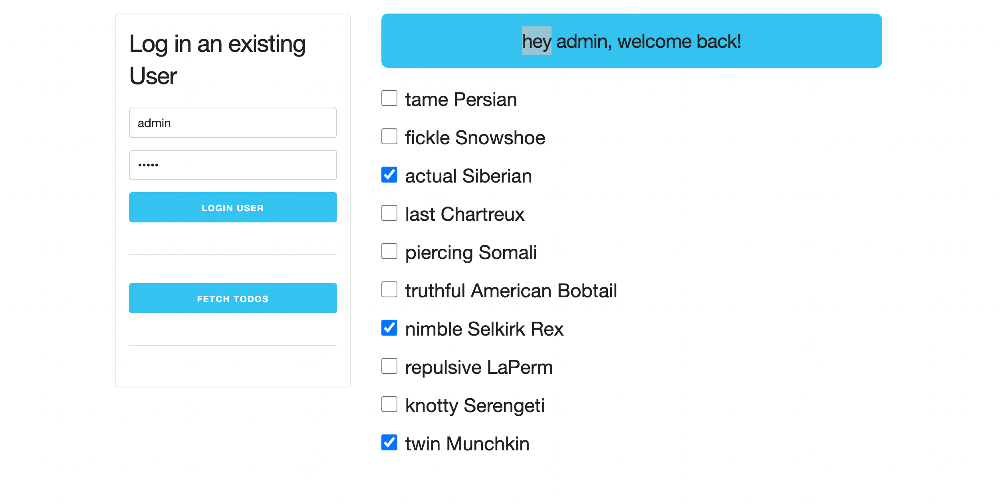
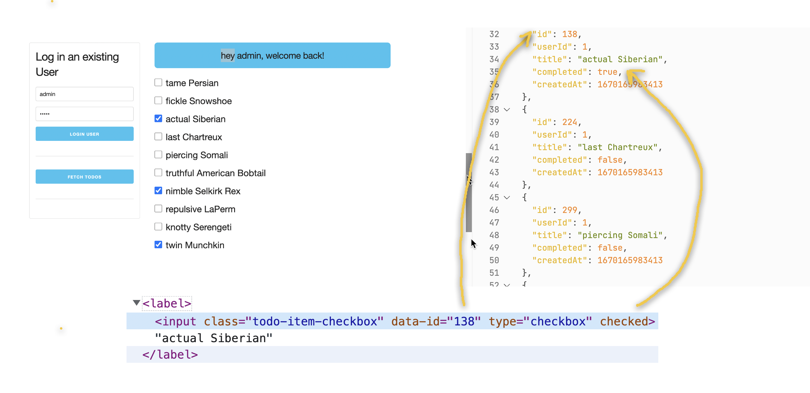

# JS-VITE-WITH-MOCK-SERVER

## Installation
```
npm install --engine-strict
```

## Start only Backend server
```
npm run server
```

## Start only Frontend server
```
npm run start
```

## Start both BE & FE in a single command
```
npm run watch
```

# Important files
```
.
├── index.html
├── scripts
│   └── main.js
└── styles
    └── style.css
```

- Use node version(LTS) should be `v16.16.0`
- Don't change/override package.json

## Maximum Marks - 10

- The Submission should not contain spaces, for example /rct-101 folder/eval will not work
- Do not push node_modules and package_lock.json to GitHub

```
 ✅ able to submit the app - 1 mark ( minimum score )
 ✅ Check if a user is able to log in - 1 mark
 ✅ Check if notification is rendered after logging in - 2 mark
 ✅ Check if keys in local storage are set - 1 mark
 ✅ Check if authenticated fetch request is made and todos are being displayed - 2 marks
 ✅ Check markup of individual todo item - 1 mark
 ✅ Check markup of the todo wrapper - 1 mark
 ✅ Check if the toggle of completed is persisted in DB - 2 mark
```

# Problem statement

1. A user must be able to log in. For example username: `admin`, example password: `admin`. In order to log in you need to make the following request
```
  POST `${baseServerURL}/user/login`
  Content-Type: application/json

  {
    "username": <username>,
    "password": <password>
  }
```

`${baseServerURL}/user/login` is already stored in a variable called `userLoginURL` for you.



2. Once a user logs in, a notification similar to the image below should be shown. The format of the message must be `hey <username>, welcome back!`. 

The markup of the notification must be: 
```
<h5 class="notification info">
    hey <username>, welcome back!
</h5>
```
It must be placed inside `#notifications-wrapper`. An element with ID `notifications-wrapper` is already present in the HTML.

   

3. As soon as the user successfully logs in, these variables in the `main.js` file should be set:
```
   let userAuthToken = get the value of JWT accessToken from localStorage is not present set null 
   let userId = get the value of user id from localStorage is not present set null
```
- **`Hint`**: for example to set variable *userAuthToken* value use `localStorage.getItem("localAccessToken") || null`

4. As soon as the user successfully logs in, these local storage keys must be set:
```
    "localAccessToken" : <JWT accessToken of logged in user>;
    "userId" : <user.id of logged in user>;
```

5. Once the user has logged in, you must be able to fetch todos by making an authenticated fetch request. The request had to be made to the following url

```
`${baseServerURL}/todos?userId=${userId}`
```
A variable called `urlAllTodosOfUser` has already been created for you.




6. Once the fetch todos button is clicked you must be able to see the todo items



7. The markup of each todo item must be as follows

Items with completed: false: 
```
<label><input class="todo-item-checkbox" data-id="107" type="checkbox">fickle Snowshoe</label>
```
Items with completed: true: 
```
<label><input class="todo-item-checkbox" data-id="138" type="checkbox" checked="">actual Siberian</label>
```
- each item is wrapped by a `label` tag
- each item is an input of type checkbox
- each item has a class `todo-item-checkbox`
- data-id is the id of the todo item
- if it's completed, the checkbox is checked



8. The list of todo items must be wrapped with the following div

```
<div id="todo-wrapper" class="todo-wrapper">
  ...
  ...
  ...
</div>
```


9. When the checkbox is toggled, you need to make a `PATCH` request to toggle the `completed` value. The patch request must be made to the following URL

```
`${baseServerURL}/todos/<todo id>`
```
A variable for `${baseServerURL}/todos/` has already been created for you in the main.js file called `urlTodosBase`